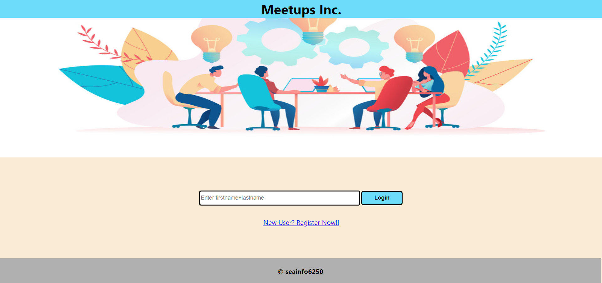
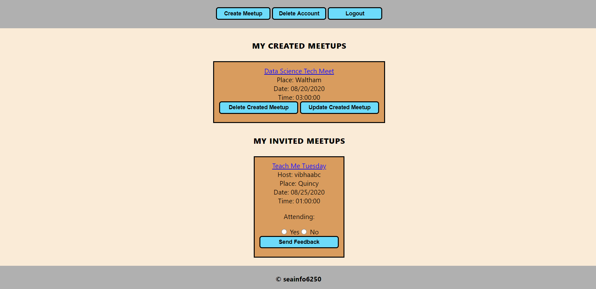

### User Interface

### Module-based functionality

#### Signin/Login Page (Component - LoginPage): 
There can be two possibility: 
* New User: If the user is new and do not have an account on the app, they would new to register with the help of the link provided for a new account.
* Existing User: If the user is existing, i.e they already have an account on the app, they just have to enter their username used while registring for the account.

### Signup/Registration Page (Component - Registration): 
* If the user does not have an account on this app, the registration page will help to register a user for login details. 
* For registration, one requires to fill up first name and last name and the concatenation of firstname and lastname becomes the username of a particular user use for login.

### User Home Page/Dashboard (Component - UserHome): 
The home page after the user logs in to the account can also be called as the main dash board of the user which has the following features:

#### Delete User Account Button (Component - DeleteUser)
User can delete its account if they wish to by clicking on this button and we are re-directed to login page. After deleting, the account will no longer exist and the user will have to register again in case if he wish to keep using using the application

#### Refresh Button (Component - Refresh)
The refresh button is used to refresh and get the current content on this page in case of any meetups gets modified.

#### Logout Button (Component - LogoutPage)
For logging out of the current account, the user will be clicking the logout button. After logging out the user data still be intact unlike the delete account scenario. After logging out, we will be redirected to the login page.

#### Create Meetup Button (Component - NewMeetup)
User can create new meetups having the Meetup Title, Place, Date, Time and Agenda which happens to be the fields required to create a meetup along with the list of registered members that needs to be invited for the meetup. Once we submit the newly created meetup form, we see a summary of the created meetup, this meetup can be seen in the created meetups list of the user which have created the meetup and for the invited members, this meetup request will be seen in the invited meetup list. From meetup summary page we have a link to navigate back to the home page.

#### Created Meetup list (Component - CreatedMeetup)
This is the list of all the meetups which are created by the user. Each of the meetup in the list has Meetup Title, Place, Date, Time which gives and easy overview of the meetup. It also has following two buttons associated with each meetup:

* Update Meetup (Component - UpdateMeetup.jsx):
The update button redirects us to the page which helps the user to make modifications in the selected meetup and submit it.

* Delete Meetup:
In order to delete the created meetup, the user selects this button which makes the meetup non exisitent from all invited members list too.

#### Invited Meetup list (Component - InvitedMeetup)
The invited meetup list contains the list of all the meetups to which the user has been invited to. It has the fields like Meetup title, Date, Time, Place which gives easy view of the meetup along with:
* Feedback options (radio buttons) of Yes/No giving the availability of the invited user.
* Update Feedback button to update the availability of the user
* Delete Meetup button only deletes the meetup from a users invited list and not the actual meetup itself
 
### Server-side files (Folder: server)
* index.js contains all rest service APIs
* users-info.js contains all users related functionality
* meetup-info.js contains all events related functionality
* authorize.js contains function used to validate a username

### Component files (Folder: components)
This folder contains all the components in the application that is described above 

### Steps to re-execute the application:

* run npm install
* Production Build: 1) npm run build 2) npm run server
* Development Build: npm run server along with npm run start/npm start 

### Images Reference
background-image: VectorStock.com/28955558
